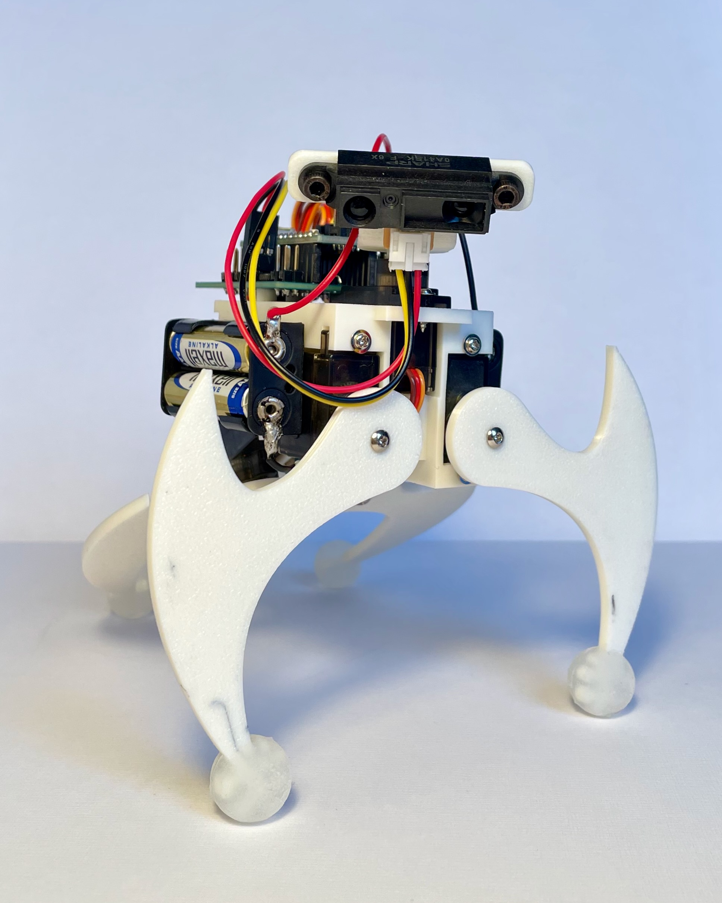

<h1>Vierbeiniger Krabbler</h1>

![Fusion360](https://img.shields.io/badge/Fusion360-%232e2e2e.svg?style=for-the-badge&logo=data:image/png;base64,iVBORw0KGgoAAAANSUhEUgAAAB4AAAAgCAMAAAAynjhNAAAAIGNIUk0AAHomAACAhAAA+gAAAIDoAAB1MAAA6mAAADqYAAAXcJy6UTwAAAKRUExURf+UR/9qAP9tBf9sAf9rAKpFADcAAJlABAAAAJI7AP+UR/+WSv+KN/9uBf9rAP9rAP9rAP9rAP+UR/+UR/+VSP9rAP9sAf+UR/+UR/9rAP9rAP+UR/97AP+UR/ppAKhFAJA6AP/dxeRfAJY9AJI7AJI7AP+scf+tc/+pbP+qbPCIPblbGv+UR/+XSaxQEZE6AP+UR5A5AJI7AMCNa5I7ANe3osmegZI7AJI7AJI7AJI7AP+MOv9uBf9rAP+UR/+USP9qAP+MOf9tBP95Gf97HP94F/9sAv+VSP+LOP98Hf/s3//r3f/t4P/Ts/90D/9sAP9/Iv/w5f/////+/f/9/P/hzP91EeFeAJU8AJI7AP9+Iv/v4//27/+naP+VSf+XS/+XTP+OPP/y6P+AJf9nAP9oAP9pAP/y6f+GLv9vBv9uBv9sAf/7+f/cwv/Vtv/WuP/PrP+BJv/69/+LN//48/+6if95GP+DKf/w5v/06/+DKv90EP+ye/+rb/92FP+MOP9uBONeAPySRd50KcpUAspTAMlTAMpUALpNAJQ8AP+VR5Y+A5A6AJE6AI83AI84AJA5AJE7AJI6AJhFDrFzSbJ1TJlHEJQ/Ba1rP7V6Up1PG5I7AadgMbZ9VqNZKMCNa9q8qOPNvsqghLuFYOTPwdSym6xqPufVyNa2oOXRw6FWI5E5AJxMF69vROLKu8eae9SxmuTOwM6njbqDXp9SHuraz7BxR5A4AJVABqdhMtu+q9Kul9/FtMaZeufUx+DHt51OGurYzbFySJM8AsWWd8qgg9W0ntzBr+HJus6njOPMvbmBXMmegezc0qZfL6JYJ8WXecaYeppKE8CPbcmdgJVAB7d+WMuihrJ0S5M9A5E4AHIAmW4AAAA7dFJOUwAAAAAAAAAAAAADTM79/P3vYSKP7LMGbtW7CP0G/sMmHv724d79/v7+/vD+5oV9/jJgY/5i/v5Z/iHJjEdslAAAAAFiS0dEUg1gLZAAAAAHdElNRQfoBx4RADV/csKXAAABhElEQVQYGX3Bv2oUURiH4fd3zjdnJnsmSLZJIaIxEMMmxQpGEdHC2sYL8R4stLT0NgI2NoJIGiGsKCRxJIGkCxjwDylMoSvOzuyyM3HJ8wg6KvEfST8lutINiRm+6JstakV/mMkks2WmPLUhFSdzQPhNJZEYUTijlOiyA7I0MOLTw5CWsizzQNdKNKR9IfHX65TShmQ0dHTW0ciBqAyMtiAJiTFHW5IcWpIwYbQlWpfkh9SMtmPgmlYKao6268u7e6/9PmNG2/dLDxzbQ8aMtiS4ginHhRwNv67Q9TQ5GtZe9cz2aTCmhlv3TyhoMpoKznFcyCjd0Udm6BUYzN2TbiPOk25+8P1HW3u3ksTMfGLOBwsuWHBm5tPBsdYl9SjdVcMbKgOzz2urVHJVhibpsTYZcZ8kKu/nawsv0rxExWXOUXmYl57HGP1CnufUjIlVlZ7k0suTRekrFcfEdoyx6Mf4o7MUY9yk4sAfMTJ425mbf5eG02e2u/OUmjL1dfWImZYG/wCcVUNYO9lMHAAAACV0RVh0ZGF0ZTpjcmVhdGUAMjAyNC0wNy0zMFQxNzowMDoyNCswMDowMB+P4X0AAAAldEVYdGRhdGU6bW9kaWZ5ADIwMjQtMDctMzBUMTc6MDA6MjQrMDA6MDBu0lnBAAAAKHRFWHRkYXRlOnRpbWVzdGFtcAAyMDI0LTA3LTMwVDE3OjAwOjUzKzAwOjAw9qVPiQAAAABJRU5ErkJggg==&logoColor=orange)

<h3>Autonome Mobile Roboter - SS 2024</h3>

